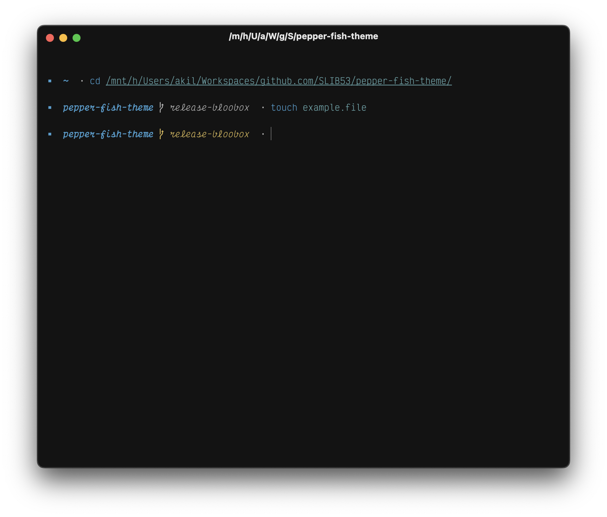

# Pepper Fish Theme

_Pepper_ is a fish theme based on my previous fish prompt, [_Page_](https://github.com/SLIB53/page-fish-theme.git). The prompt shows one level of the current working directory, and the current git branch.



## Installation & Usage

Run the [“apply theme” script](./scripts/apply_theme.sh) from fish:

```sh
fish scripts/apply_theme.fish
```

**WARNING:** This will clobber your existing prompt.


## Contribution

This is my personal fish theme I maintain for myself. Feel free to fork!
