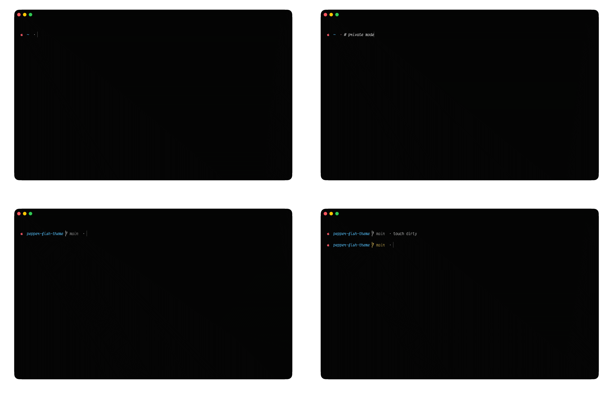

# Pepper Fish Theme

_Pepper_ is a fish theme showing an indicator for the system, the current working directory, git status, and a bullet for the prompt indicator.




## Requirements

* git


## Installation & Usage

Run the [“apply theme” script](./scripts/apply_theme.sh) from fish:

```sh
fish scripts/apply_theme.fish
```

**WARNING:** This will clobber your existing prompt.


## Contribution

This is my personal fish theme I maintain for myself. Feel free to fork!
